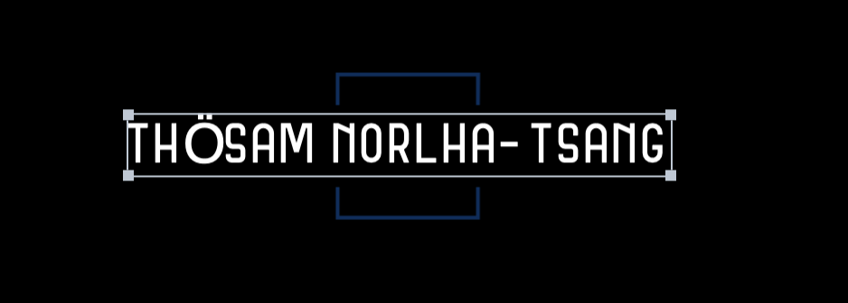

  
  
# Thösam's Personal Website

Welcome to my personal website! This website serves as a platform to showcase my portfolio, skills, and projects. Whether you're a potential employer, collaborator, or just someone interested in learning more about me, you'll find all the relevant information here.

# Project Overview

This personal website project was built using TypeScript, Tailwind CSS, and Next.js. It provides a clean and modern design while ensuring optimal performance and responsiveness across various devices.

The main objectives of this project include:
- Creating a professional online presence to showcase my work and skills.
- Highlighting my experience, education, and achievements in the field of computer science.
- Providing easy access to my portfolio, resume, and contact information for potential opportunities.

# Features

- **Portfolio:** Explore my projects and see what I've been working on.
- **About Me:** Learn more about my background, skills, and interests.
- **Resume:** Download my latest resume to get detailed information about my experience and qualifications.
- **Contact:** Reach out to me directly via email or social media channels.
- **Blog:** Check out my blog page where I write articles on various topics related to technology, computer science and life in general.

# Technologies Used

- **TypeScript:** Leveraging the benefits of static typing for a more robust codebase.
- **Tailwind CSS:** Rapidly style components with utility-first CSS classes.
- **Next.js:** Utilize server-side rendering and other Next.js features for enhanced performance and SEO.
- **SonarCloud:** Ensuring clean code and maintaining code quality.
- **Dependabot:** Keeping the project dependencies up to date automatically.

# Getting Started

To run this project locally, follow these steps:

1. Clone this repository to your local machine.
2. Navigate to the project directory.
3. Install dependencies using `npm install`.
4. Start the development server with `npm run dev`.
5. Open your web browser and visit `http://localhost:3000` to view the website.

Feel free to explore the codebase, make modifications, and customize the website to fit your needs!

# Feedback

I'm constantly looking to improve my website and welcome any feedback or suggestions you may have. If you encounter any issues, have ideas for new features, or just want to say hello, please don't hesitate to reach out.
